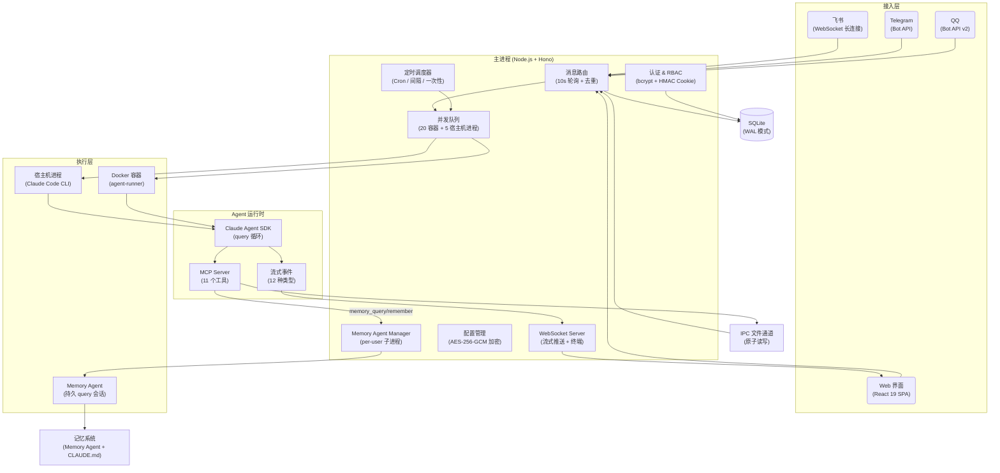

<p align="center">
  
</p>

<h1 align="center">happyclaw_codex</h1>

<p align="center">
  HappyClaw 的实验性 fork，聚焦更强的记忆能力与更高的 Agent 自主性
</p>

<p align="center">
  <a href="LICENSE"></a>
  <a href="https://nodejs.org"></a>
  
  <a href="https://github.com/riba2534/happyclaw"></a>
</p>

<p align="center">
  <a href="#这个-fork-是什么">介绍</a> · <a href="#核心能力">核心能力</a> · <a href="#快速开始">快速开始</a> · <a href="#技术架构">技术架构</a> · <a href="#贡献">贡献</a>
</p>

---

| 聊天界面 — 工具调用追踪 | 聊天界面 — Markdown 渲染 | 聊天界面 — 图片生成 + 文件管理 |
|:--------------------:|:-------------------:|:----------------------:|
|  |  |  |

<details>
<summary>📸 更多截图</summary>
<br/>

**设置向导**

| 创建管理员 | 配置接入（飞书 + Claude / Codex） |
|:--------:|:---------------------:|
|  |  |

**移动端 PWA**

| 登录 | 工作区 | 系统监控 | 设置 |
|:---:|:-----:|:------:|:---:|
|  |  |  |  |

**飞书集成**

| Bot 聊天 | 富文本卡片回复 |
|:-------:|:----------:|
|  |  |

</details>

### 截图说明

- **创建管理员** — 首次启动后会进入初始化向导，先创建本地管理员账号，没有默认用户名和密码
- **配置接入（飞书 + Claude / Codex）** — 第二张图对应设置向导中的 Provider 与 IM 通道配置页。这个 fork 当前最推荐先配置 **Codex**，因为可以直接复用本机 `codex login`
- **移动端 PWA** — 登录、工作区、监控、设置四张图展示的是安装到手机桌面后的形态，不需要单独的移动端 App
- **飞书集成** — 左图是 Bot 对话入口，右图是富文本卡片回复。飞书 / Telegram / QQ 都是可选能力，不影响先在 Web 中完成初始化

## 这个 Fork 是什么

本项目是 [HappyClaw](https://github.com/riba2534/happyclaw) 的实验性 fork，基于上游的自托管多用户 AI Agent 系统，重点探索四个方向：

1. **Memory Agent 系统** — 独立的 per-user 记忆子进程，自动归档对话、构建索引、深度整理，替代上游的 inline MCP 记忆工具
2. **显式消息路由** — Agent 的 stdout 仅显示在 Web 端，IM 消息必须通过 `send_message` MCP 工具显式发送，Agent 自主控制消息路由
3. **Skills 自主创建** — 移除注册表安装机制，Agent 通过 `skill-creator` 直接在文件系统中创建和管理 Skills
4. **双 Provider 执行链路** — 在保留 Claude Code 的同时，引入 Codex Provider，支持按工作区切换 Claude / Codex，并支持 Codex CLI 登录态或 OpenAI API Key 两种接入方式

上游会定期选择性合并。上游的完整功能介绍请参考 [原项目 README](https://github.com/riba2534/happyclaw)。

## 与原版 HappyClaw 的主要差异

**这个 fork 把记忆系统改成了独立的 Memory Agent，并强化了会话隔离、IPC 和持久化目录约定，因此运行结构和上游并不相同。**

**这个 fork 采用 Codex / Claude 双 Provider 链路，且 IM 消息必须通过 `send_message(channel=...)` 显式路由，不再默认复用 Agent stdout。**

### 关键特性

- **原生 Claude Code 驱动** — 基于 Claude Agent SDK，底层为完整的 Claude Code CLI 运行时，继承其全部能力
- **Codex Provider** — 内置 `CodexRunner`，支持 Codex CLI 登录态（`~/.codex/auth.json`）与 OpenAI API Key / Base URL 模式
- **多用户隔离** — Per-user 工作区、Per-user IM 通道、RBAC 权限体系、邀请码注册、审计日志，每个用户拥有独立的执行环境
- **移动端 PWA** — 针对移动端深度优化，支持一键安装到桌面，iOS / Android 均已适配，随时随地通过手机访问 AI Agent
- **四端消息统一路由** — 飞书 WebSocket 长连接（富文本卡片、Reaction 反馈）、Telegram Bot API、QQ Bot API v2（私聊 + 群聊 @Bot）、Web 界面，四端消息统一路由

> 项目借鉴了 [OpenClaw](https://github.com/nicepkg/OpenClaw) 的容器化架构，并融合了 Claude Code 官方 [Cowork](https://github.com/anthropics/claude-code/tree/main/packages/cowork) 的多会话协作思路：多个独立 Agent 会话并行工作，各自拥有隔离的工作空间和持久记忆，结果通过 IM 渠道送达。

## 核心能力

### 多渠道接入

| 渠道 | 连接方式 | 消息格式 | 特色 |
|------|---------|---------|------|
| **飞书** | WebSocket 长连接 | 富文本卡片 | 图片消息（Vision）、文件消息自动下载到工作区、Reaction 反馈、自动注册群组 |
| **Telegram** | Bot API (Long Polling) | Markdown → HTML | 长消息自动分片（3800 字符）、图片走 Vision（base64）、文档文件自动下载到工作区 |
| **QQ** | WebSocket (Bot API v2) | 纯文本 | 私聊 + 群聊 @Bot、图片消息（Vision）、配对码绑定 |
| **Web** | WebSocket 实时通信 | 流式 Markdown | 图片粘贴/拖拽上传、虚拟滚动 |

每个用户可独立配置自己的 IM 通道（飞书应用凭据、Telegram Bot Token、QQ Bot 凭据），互不干扰。

**Fork 特有的显式路由模型**：Agent 的 stdout（流式输出）仅显示在 Web 端。IM 用户看不到思考过程和工具调用——Agent 通过 `send_message(channel=...)` MCP 工具主动向 IM 发送最终结果，`channel` 值取自消息的 `source` 属性。


### Agent 执行引擎

执行层采用双 Provider 结构：

- **Claude**：基于 [Claude Agent SDK](https://github.com/anthropics/claude-code/tree/main/packages/claude-agent-sdk)，底层调用完整的 Claude Code CLI
- **Codex**：基于 `@openai/codex-sdk`，支持读取本机 `~/.codex/auth.json` 或使用 OpenAI API Key / Base URL

- **Per-user 主工作区** — 每个用户拥有一个固定的主工作区（admin 使用宿主机模式，member 使用容器模式），IM 消息路由到各自的主工作区
- **宿主机模式** — Agent 直接在宿主机运行，访问本地文件系统，零 Docker 依赖（admin 主工作区默认模式）
- **容器模式** — Docker 隔离执行，非 root 用户，预装 40+ 工具（member 主工作区默认模式）
- **多会话并发** — 最多 20 个容器 + 5 个宿主机进程同时运行，会话级队列调度
- **自定义工作目录** — 每个会话可配置 `customCwd` 指向不同项目
- **失败自动恢复** — 指数退避重试（5s → 80s，最多 5 次），上下文溢出自动压缩并归档历史


### 实时流式体验

Agent 的思考和执行过程实时推送到前端，而非等待最终结果：

- **思考过程** — 可折叠的 Extended Thinking 面板，逐字推送
- **工具调用追踪** — 工具名称、执行耗时、嵌套层级、输入参数摘要
- **调用轨迹时间线** — 最近 30 条工具调用记录，快速回溯
- **Hook 执行状态** — PreToolUse / PostToolUse Hook 的启动、进度、结果
- **流式 Markdown 渲染** — GFM 表格、代码高亮、图片 Lightbox


### 11 个 MCP 工具

Agent 在运行时可通过内置 MCP Server 与主进程通信：

| 工具 | 说明 |
|------|------|
| `send_message` | 发送文本消息，可指定 `channel` 路由到 IM（省略则仅 Web 显示） |
| `send_image` | 发送图片到 IM 渠道（10MB 限制） |
| `send_file` | 发送文件到 IM 渠道（30MB 限制） |
| `schedule_task` | 创建定时/周期/一次性任务（cron / interval / once） |
| `list_tasks` | 列出定时任务 |
| `pause_task` / `resume_task` / `cancel_task` | 暂停、恢复、取消任务 |
| `register_group` | 注册新群组（仅 admin 主工作区） |
| `memory_query` | 查询 Memory Agent 记忆（同步，返回结果） |
| `memory_remember` | 存储信息到 Memory Agent（异步） |

### 定时任务

- 三种调度模式：**Cron 表达式** / **固定间隔** / **一次性执行**
- 两种上下文模式：`group`（在指定会话中执行）/ `isolated`（独立隔离环境）
- 完整的执行日志（耗时、状态、结果），Web 界面管理


### 记忆系统（Fork 特有：Memory Agent）

独立的 per-user Memory Agent 子进程管理持久记忆，替代上游的 inline MCP 工具：

- **Memory Agent** — 每个用户一个子进程，使用 Claude Agent SDK 持久 query 会话，自动归档对话、生成印象、维护知识索引
- **随身索引** — `data/memory/{userId}/index.md`，主 Agent 每次对话自动加载，Memory Agent 查询后自修复索引
- **自动会话归档** — 容器退出时自动导出对话转录到 `transcripts/`，触发 `session_wrapup` 生成印象/知识
- **深度整理** — `global_sleep` 定期压缩索引、清理旧印象、更新用户画像（需距上次 >6h、无活跃会话、有待处理 wrapup）
- **会话记忆** — `data/groups/{folder}/CLAUDE.md`，会话私有（与上游相同）
- **Web 管理** — Memory Agent 状态面板、手动触发按钮、超时配置、记忆文件在线编辑


### Skills 系统（Fork 特有：Agent 自主创建）

- **项目级 Skills** — 放在 `container/skills/`，只读挂载到所有容器（`agent-browser`、`skill-creator`、`post-test-cleanup`）
- **用户级 Skills** — `data/skills/{userId}/`，Agent 可通过 `skill-creator` 自主创建新 Skills，直接写入文件系统
- **主机同步** — 可将宿主机 `~/.claude/skills/` 同步到用户目录
- 无需重建镜像，volume 挂载 + 符号链接自动发现。上游的注册表安装机制已移除

### Web 终端

基于 xterm.js + node-pty 的完整终端：WebSocket 连接，可拖拽调整面板，直接在 Web 界面中操作服务器。


### 移动端 PWA

专为移动端优化的 Progressive Web App，手机浏览器一键安装到桌面：

- **原生体验** — 全屏模式运行，独立的应用图标，视觉上与原生 App 无异
- **响应式布局** — 移动端优先设计，聊天界面、设置页面、监控面板均适配小屏幕
- **iOS / Android 适配** — 安全区域适配、滚动优化、字体渲染、触摸交互
- **随时可用** — 任何时间、任何地点，掏出手机就能与 AI Agent 对话、查看执行状态、管理任务


### 文件管理

上传（50MB 限制）/ 下载 / 删除，目录管理，图片预览，拖拽上传。路径遍历防护 + 系统路径保护。

### 安全与多用户

| 能力 | 说明 |
|------|------|
| **用户隔离** | 每个用户拥有独立的主工作区（`home-{userId}`）、工作目录、IM 通道 |
| **个性化设置** | 用户可自定义 AI 名称、头像 emoji 和颜色 |
| **RBAC** | 5 种权限，4 种角色模板（admin_full / member_basic / ops_manager / user_admin） |
| **注册控制** | 开放注册 / 邀请码注册 / 关闭注册 |
| **审计日志** | 18 种事件类型，完整操作追踪 |
| **加密存储** | API 密钥 AES-256-GCM 加密，Web API 仅返回掩码值 |
| **挂载安全** | 白名单校验 + 黑名单模式匹配（`.ssh`、`.gnupg` 等敏感路径） |
| **终端权限** | 用户可访问自己容器的 Web 终端（宿主机模式不支持） |
| **登录保护** | 5 次失败锁定 15 分钟，bcrypt 12 轮，HMAC Cookie，30 天会话有效期 |
| **PWA** | 一键安装到手机桌面，移动端深度优化，随时随地使用 AI Agent |

## 快速开始

### 推荐路径

根据你的部署目标，推荐直接选择下面其中一条：

| 场景 | 推荐路径 | 是否需要 Docker |
|------|---------|----------------|
| **先在本机跑通，验证 Codex 能力** | Codex CLI 登录 + 宿主机模式 | 否 |
| **需要分享给多个 member 使用** | Codex / Claude Provider + 容器模式 | 是 |
| **已经有 Claude 账号，想保留 Claude Code 体验** | Claude Provider + 宿主机/容器模式 | 视模式而定 |

### 前置要求

开始之前，请确保以下依赖已安装：

**必需**

- **[Node.js](https://nodejs.org) >= 20** — 运行主服务和前端构建
  - macOS: `brew install node`
  - Linux: 参考 [NodeSource](https://github.com/nodesource/distributions) 或使用 `nvm`
  - Windows: [官网下载](https://nodejs.org)

- **[Docker](https://www.docker.com/)** — 容器模式运行 Agent（member 用户需要；admin 仅宿主机模式可不装）
  - macOS: 推荐 [OrbStack](https://orbstack.dev)（更轻量），也可用 [Docker Desktop](https://www.docker.com/products/docker-desktop/)
  - Linux: `curl -fsSL https://get.docker.com | sh`
  - Windows: [Docker Desktop](https://www.docker.com/products/docker-desktop/)

- **至少一种 AI Provider 凭据**
  - **Codex CLI 登录态** — 运行 `codex login`，本机生成 `~/.codex/auth.json`
  - **OpenAI / 兼容网关 API Key** — 若使用 Codex 的 API Key 模式，在 Web 中配置
  - **Claude API / Claude Code 登录态** — 若使用 Claude Provider，在 Web 中配置

**可选**

- 飞书企业自建应用凭据 — 仅飞书集成需要，前往 [飞书开放平台](https://open.feishu.cn) 创建
- Telegram Bot Token — 仅 Telegram 集成需要，通过 [@BotFather](https://t.me/BotFather) 获取
- QQ Bot 凭据 — 仅 QQ 集成需要，前往 [QQ 开放平台](https://q.qq.com/qqbot/openclaw/index.html) 创建

> Claude Code CLI 无需手动安装——项目依赖的 Claude Agent SDK 已内置完整的 CLI 运行时，`make start` 首次启动时自动安装。Codex 模式则依赖本机现有的 `codex login` 登录态，或通过 Web 配置 OpenAI API Key。

### 安装启动

最短路径如下：

```bash
# 1. 克隆仓库
git clone git@github.com:houskii/happyclaw_codex.git
cd happyclaw_codex

# 2. 安装依赖
make install

# 3. 编译
make build

# 4. 启动
make start
```

访问：`http://localhost:3000`

如需公网访问，可自行使用 nginx / caddy 配置反向代理。

### 本地最小初始化（推荐先走 Codex）

如果你只是想先在本机快速跑通 Web 和宿主机模式，不依赖 Docker，推荐按下面走：

```bash
# 1. 登录 Codex（只需一次）
codex login

# 2. 安装依赖
make install

# 3. 启动服务
make start
```

然后访问 `http://localhost:3000`，按这个顺序完成初始化：

1. 创建管理员账号
2. 进入「设置 → Codex 提供商」
3. 选择其一：
   - **CLI 登录模式**：直接复用本机 `~/.codex/auth.json`
   - **API Key 模式**：填写 `OPENAI_API_KEY` / Base URL / 默认模型
4. 在工作区里把 LLM Provider 切到 **OpenAI (Codex)**

完成后建议立刻做一个最小验证：

1. 打开默认主工作区
2. 发送一句简单消息，例如：`请先输出当前目录和可用 provider`
3. 确认 Web 中能看到流式输出
4. 再去「系统监控」确认没有容器报错或 Provider 配置错误

### 设置向导逐步说明

初始化向导建议按下面理解，不需要一次把所有集成都配齐：

1. **创建管理员** — 自定义用户名和密码（无默认账号）
2. **配置至少一个 Provider**
   - Claude：填写 Claude API / OAuth / setup-token
   - Codex：选择 CLI 登录模式或填写 OpenAI API Key / Base URL
3. **配置 IM 通道**（可选）— 飞书 App ID/Secret、Telegram Bot Token 或 QQ Bot 凭据
4. **开始对话** — 在 Web 聊天页面直接发送消息

> 所有配置通过 Web 界面完成，不依赖任何配置文件。API 密钥 AES-256-GCM 加密存储。

### Codex 配置说明

当前 fork 中，Codex 有两种接入方式：

#### 方式一：CLI 登录模式（推荐本机开发）

适合你已经在这台机器上完成 `codex login` 的情况。

- 优点：不需要再重复填写 API Key
- 适合：个人开发机、先验证能力、宿主机模式
- 依赖：本机存在 `~/.codex/auth.json`

在 Web 中你应该看到：

- 配置入口：`设置 → Codex 提供商`
- 可选模式：`CLI 登录模式` / `API Key 模式`
- 模型字段：默认 `gpt-5.4`，可按需改成你自己的默认模型

#### 方式二：API Key 模式（推荐服务器部署）

适合你不希望依赖本机登录态，或者需要接兼容 OpenAI 协议的网关。

- 必填：`OPENAI_API_KEY`
- 可选：`OPENAI_BASE_URL`
- 推荐：将默认模型与部署环境统一，不要让不同工作区混用不同模型名

### 切换工作区 Provider

Provider 配置完成后，还需要确认工作区级别的执行 Provider 已切换：

1. 进入工作区设置（聊天页右上角齿轮）
2. 找到 `LLM Provider`
3. 选择：
   - `Claude`
   - `OpenAI (Codex)`
4. 保存后重新发一条消息验证

如果只配置了 Codex Provider，但工作区仍停留在 Claude，那么会表现为：

- 配置页保存成功
- 聊天时仍然走 Claude 逻辑
- 或因为没有 Claude 凭据而直接报错


### 启用容器模式

admin 用户默认使用宿主机模式（无需 Docker），开箱即用。如果需要容器模式（member 用户注册后自动使用）：

```bash
# 构建容器镜像
./container/build.sh
```

新用户注册后会自动创建容器模式的主工作区（`home-{userId}`），无需额外配置。

如果你现在只是验证 Codex 接入，不必先启用容器模式。没有 Docker 时，系统仍可先以 admin 宿主机模式正常启动。

### 配置飞书集成

1. 前往 [飞书开放平台](https://open.feishu.cn)，创建企业自建应用
2. 在应用的「事件订阅」中添加：`im.message.receive_v1`（接收消息）
3. 在应用的「权限管理」中开通以下权限：
   - `cardkit:card:write`（创建和更新卡片）
   - `im:chat`（获取与更新群组信息）
   - `im:chat:read`（获取群组信息）
   - `im:chat:readonly`（以应用身份读取群组信息）
   - `im:message`（发送消息）
   - `im:message.group_at_msg:readonly`（接收群聊 @消息）
   - `im:message.group_msg`（接收群聊所有消息）— **敏感权限**，需管理员审批。如不开通，群聊中只有 @机器人 的消息才会被处理
   - `im:message.p2p_msg:readonly`（接收私聊消息）
   - `im:resource`（获取与上传图片或文件资源）

   <details>
   <summary>📋 权限 JSON（可直接导入飞书开放平台）</summary>

   ```json
   {
     "scopes": {
       "tenant": [
         "cardkit:card:write",
         "im:chat",
         "im:chat:read",
         "im:chat:readonly",
         "im:message",
         "im:message.group_at_msg:readonly",
         "im:message.group_msg",
         "im:message.p2p_msg:readonly",
         "im:resource"
       ],
       "user": []
     }
   }
   ```

   </details>

4. 发布应用版本并等待审批通过
5. 在 HappyClaw Web 界面的「设置 → IM 通道 → 飞书」中填入 App ID 和 App Secret

每个用户可在个人设置中独立配置飞书应用凭据，实现 per-user 的飞书 Bot。

> **群聊 Mention 控制**：默认群聊中需要 @机器人 才会响应。可通过 `/require_mention false` 命令切换为全量响应（需要 `im:message.group_msg` 权限）。

### Docker 环境注入

如果你希望所有 Docker 工作区默认继承宿主机中的部分环境变量，可以在：

- `设置 → 系统参数 → Docker 环境注入`

中进行配置。页面会读取当前宿主机环境变量的 `key/value`，支持搜索和勾选。保存后，后续新启动的 Docker 工作区会自动注入这些环境变量。

适合放在这里的通常是：

- `HTTP_PROXY`
- `HTTPS_PROXY`
- `NO_PROXY`
- 其他需要统一带进容器的基础网络或平台变量


### 配置 Telegram 集成

1. 在 Telegram 中搜索 [@BotFather](https://t.me/BotFather)，发送 `/newbot` 创建 Bot
2. 记录返回的 Bot Token
3. 在 HappyClaw Web 界面的「设置 → IM 通道 → Telegram」中填入 Bot Token
4. **群聊使用**：如需在 Telegram 群中使用 Bot，需在 BotFather 中发送 `/mybots` → 选择 Bot → Bot Settings → Group Privacy → Turn off，否则 Bot 只能接收 `/` 命令消息


### 配置 QQ 集成

1. 前往 [QQ 开放平台](https://q.qq.com/qqbot/openclaw/index.html)，使用手机 QQ 扫码注册登录
2. 创建机器人，设置名称和头像
3. 在机器人管理页面获取 **App ID** 和 **App Secret**
4. 在 HappyClaw Web 界面的「设置 → IM 通道 → QQ」中填入 App ID 和 App Secret
5. **配对绑定**：在设置页生成配对码，然后在 QQ 中向 Bot 发送 `/pair <配对码>` 完成绑定

> QQ Bot 使用官方 API v2 协议，支持 C2C 私聊和群聊 @Bot 消息。群聊中 Bot 仅接收 @Bot 的消息。

### IM 斜杠命令

飞书/Telegram/QQ 中以 `/` 开头的消息会被拦截为斜杠命令（未知命令继续作为普通消息处理）：

| 命令 | 缩写 | 用途 |
|------|------|------|
| `/help` | - | 查看当前支持的斜杠命令说明 |
| `/list` | `/ls` | 查看所有工作区和对话列表 |
| `/status` | - | 查看当前工作区/对话状态 |
| `/where` | - | 查看当前绑定位置和回复策略 |
| `/bind <target>` | - | 绑定到指定工作区或 Agent（如 `/bind myws` 或 `/bind myws/a3b`） |
| `/unbind` | - | 解绑回默认工作区 |
| `/new --help` | - | 查看新建工作区命令参数说明 |
| `/new <名称> [--provider claude\|openai] [--mode container\|host] [--workspace <绝对路径>]` | - | 创建新工作区并绑定当前群组；`--workspace` 仅在 `host` 模式下生效 |
| `/modify --help` | - | 查看当前工作区修改命令参数说明 |
| `/modify [--provider claude\|openai] [--mode container\|host] [--workspace <绝对路径>] [--env KEY=VALUE] [--unset-env KEY]` | - | 修改当前绑定工作区的运行配置与环境变量；`--workspace` 仅在 `host` 模式下生效 |
| `/recall` | `/rc` | AI 总结最近对话记录 |
| `/clear` | - | 清除当前对话的会话上下文 |
| `/require_mention` | - | 切换群聊响应模式：`true`（需要 @）或 `false`（全量响应） |


### 执行模式

| 模式 | 说明 | 适用对象 | 前置要求 |
|------|------|---------|---------|
| **宿主机模式** | Agent 直接在宿主机运行，访问本地文件系统 | admin 主工作区（`folder=main`） | Claude 或 Codex Provider |
| **容器模式** | Agent 在 Docker 容器中隔离运行，预装 40+ 工具 | member 主工作区（`folder=home-{userId}`） | Docker Desktop + 构建镜像 |

admin 主工作区默认使用宿主机模式，member 注册后自动创建容器模式的主工作区。也可在 Web 界面的会话管理中手动切换执行模式。

### 容器工具链

容器镜像基于 `node:22-slim`，预装以下工具：

| 类别 | 工具 |
|------|------|
| AI / Agent | Claude Code CLI、Claude Agent SDK、Codex SDK、MCP SDK |
| 浏览器自动化 | Chromium、agent-browser |
| 编程语言 | Node.js 22、Python 3、uv / uvx |
| 编译构建 | build-essential、cmake、pkg-config |
| 文本搜索 | ripgrep (`rg`)、fd-find (`fd`) |
| 多媒体处理 | ffmpeg、ImageMagick、Ghostscript、Graphviz |
| 文档转换 | Pandoc、poppler-utils（PDF 工具） |
| 数据库客户端 | SQLite3、MySQL Client、PostgreSQL Client、Redis Tools |
| 网络工具 | curl、wget、openssh-client、dnsutils |
| Shell | Zsh + Oh My Zsh（ys 主题） |
| 其他 | git、jq、tree、shellcheck、zip/unzip |

## 技术架构

### 架构图



**数据流**：消息从接入层进入主进程，经去重和路由后分发到并发队列。队列启动宿主机进程或 Docker 容器，内部的 agent-runner 根据工作区配置选择 Claude 或 Codex Provider。流式事件（思考、文本、工具调用等 12 种类型）通过 stdout 标记协议传回主进程，经 WebSocket 广播到 Web 客户端。IM 消息由 Agent 通过 `send_message` MCP 工具显式发送，经 IPC 文件通道路由到对应 IM 渠道。Memory Agent 作为独立子进程运行，Agent 通过 `memory_query`/`memory_remember` MCP 工具经 HTTP 与之通信。

### 技术栈

| 层次 | 技术 |
|------|------|
| **后端** | Node.js 22 · TypeScript 5.7 · Hono · better-sqlite3 (WAL) · ws · node-pty · Pino · Zod |
| **前端** | React 19 · Vite 6 · Zustand 5 · Tailwind CSS 4 · shadcn/ui · Radix UI · Lucide Icons · react-markdown · mermaid · xterm.js · @tanstack/react-virtual · PWA |
| **Agent** | Claude Agent SDK · Claude Code CLI · Codex SDK · MCP SDK · IPC 文件通道 |
| **容器** | Docker (node:22-slim) · Chromium · agent-browser · Python · 40+ 预装工具 |
| **安全** | bcrypt (12 轮) · AES-256-GCM · HMAC Cookie · RBAC · 路径遍历防护 · 挂载白名单 |
| **IM 集成** | @larksuiteoapi/node-sdk (飞书) · grammY (Telegram) · QQ Bot API v2 (WebSocket + REST) |

### 目录结构

所有运行时数据统一在 `data/` 目录下，启动时自动创建，无需手动初始化。

```
happyclaw/
├── src/                          # 后端源码
│   ├── index.ts                  #   入口：消息轮询、IPC 监听、容器生命周期
│   ├── web.ts                    #   Hono 应用、WebSocket、静态文件
│   ├── routes/                   #   路由（auth / groups / files / config / monitor / memory / tasks / skills / admin / browse / agents / mcp-servers）
│   ├── feishu.ts                 #   飞书连接工厂（WebSocket 长连接）
│   ├── telegram.ts               #   Telegram 连接工厂（Bot API）
│   ├── qq.ts                     #   QQ 连接工厂（Bot API v2 WebSocket）
│   ├── im-manager.ts             #   IM 连接池（per-user 飞书/Telegram/QQ 连接管理）
│   ├── im-downloader.ts          #   IM 文件下载工具（保存到工作区 downloads/）
│   ├── container-runner.ts       #   Docker / 宿主机进程管理
│   ├── group-queue.ts            #   并发控制队列
│   ├── runtime-config.ts         #   AES-256-GCM 加密配置
│   ├── task-scheduler.ts         #   定时任务调度
│   ├── file-manager.ts           #   文件安全（路径遍历防护）
│   ├── mount-security.ts         #   挂载白名单 / 黑名单
│   └── db.ts                     #   SQLite 数据层（Schema v1→v18）
│
├── web/                          # 前端 (React + Vite)
│   └── src/
│       ├── pages/                #   13 个页面
│       ├── components/           #   UI 组件（shadcn/ui）
│       ├── stores/               #   10 个 Zustand Store
│       └── api/client.ts         #   统一 API 客户端
│
├── container/                    # Agent 容器
│   ├── Dockerfile                #   容器镜像定义
│   ├── build.sh                  #   构建脚本
│   ├── agent-runner/             #   容器内执行引擎
│   │   └── src/
│   │       ├── index.ts          #     Agent 主循环 + 流式事件
│   │       └── mcp-tools.ts      #     11 个 MCP 工具
│   ├── memory-agent/             #   Memory Agent 子进程（Fork 特有）
│   │   └── src/index.ts          #     持久 query 会话 + JSON-line 通信
│   └── skills/                   #   项目级 Skills
│
├── shared/                       # 跨项目共享类型定义
│   └── stream-event.ts           #   StreamEvent 类型单一真相源
│
├── scripts/                      # 构建辅助脚本
│   ├── sync-stream-event.sh      #   同步 shared/ 类型到各子项目
│   └── check-stream-event-sync.sh#   校验类型副本一致性
│
├── config/                       # 项目配置
│   ├── default-groups.json       #   预注册群组
│   └── mount-allowlist.json      #   容器挂载白名单
│
├── data/                         # 运行时数据（启动时自动创建）
│   ├── db/messages.db            #   SQLite 数据库（WAL 模式）
│   ├── groups/{folder}/          #   会话工作目录（Agent 可读写）
│   │   ├── downloads/{channel}/  #     IM 文件下载（feishu/telegram/qq，按日期分子目录）
│   │   └── CLAUDE.md             #     会话私有记忆
│   ├── groups/user-global/{id}/  #   用户全局记忆目录
│   ├── sessions/{folder}/.claude/#   Claude 会话持久化
│   ├── ipc/{folder}/             #   IPC 通道（input / messages / tasks）
│   ├── env/{folder}/env          #   容器环境变量文件
│   ├── memory/{userId}/          #   Memory Agent 数据（index.md / impressions / knowledge / transcripts）
│   └── config/                   #   加密配置文件
│
└── Makefile                      # 常用命令
```

### 开发指南

```bash
make dev              # 前后端并行启动（热更新）
make dev-backend      # 仅启动后端
make dev-web          # 仅启动前端
make build            # 编译全部（后端 + 前端 + agent-runner）
make start            # 一键启动生产环境
make typecheck        # TypeScript 全量类型检查
make format           # 代码格式化（Prettier）
make clean            # 清理构建产物
make reset-init       # 重置为首装状态（清空数据库、配置、工作区、记忆、会话）
make backup           # 备份运行时数据到 happyclaw-backup-{date}.tar.gz
make restore          # 从备份恢复数据（make restore 或 make restore FILE=xxx.tar.gz）
```

| 服务 | 默认端口 | 说明 |
|------|---------|------|
| 后端 | 3000 | Hono + WebSocket |
| 前端开发服务器 | 5173 | Vite，代理 `/api` 和 `/ws` 到后端（仅开发模式） |

#### 自定义端口

**生产模式**（`make start`）：只有后端服务，前端作为静态文件由后端托管，通过 `WEB_PORT` 环境变量修改端口：

```bash
WEB_PORT=8080 make start
# 访问 http://localhost:8080
```

**开发模式**（`make dev`）：前端 Vite 开发服务器（`5173`）和后端（`3000`）分别运行，开发时访问 `5173`。

修改后端端口：

```bash
# 后端改为 8080（通过环境变量）
WEB_PORT=8080 make dev-backend

# 前端需同步修改代理目标，否则 API 请求会发到默认的 3000
VITE_API_PROXY_TARGET=http://127.0.0.1:8080 VITE_WS_PROXY_TARGET=ws://127.0.0.1:8080 make dev-web
```

修改前端端口：通过 Vite CLI 参数覆盖：

```bash
cd web && npx vite --port 3001
```

### 环境变量

以下为可选覆盖项。推荐使用 Web 设置向导配置 Claude / Codex Provider 和 IM 凭据（加密存储）。

| 变量 | 默认值 | 说明 |
|------|--------|------|
| `WEB_PORT` | `3000` | Web 服务端口 |
| `ASSISTANT_NAME` | `HappyClaw` | 助手显示名称 |
| `CONTAINER_IMAGE` | `happyclaw-agent:latest` | Agent 容器镜像 |
| `OPENAI_API_KEY` | 空 | Codex API Key 模式凭据 |
| `OPENAI_BASE_URL` | 空 | Codex API 兼容网关地址 |
| `HAPPYCLAW_CODEX_MODEL` | `gpt-5.4` | Codex 默认模型 |
| `CONTAINER_TIMEOUT` | `1800000`（30min） | 容器硬超时 |
| `IDLE_TIMEOUT` | `1800000`（30min） | 容器空闲保活时长 |
| `MAX_CONCURRENT_HOST_PROCESSES` | `5` | 宿主机进程并发上限 |
| `TRUST_PROXY` | `false` | 信任反向代理的 `X-Forwarded-For` 头 |
| `TZ` | 系统时区 | 定时任务时区 |

## 常见问题

### 1. 没装 Docker，为什么系统还能启动？

这是预期行为。admin 默认使用**宿主机模式**，因此：

- Web 服务可以正常启动
- 默认主工作区可以正常对话
- 但 member 的容器工作区、容器终端、容器级隔离能力不会可用

如果日志里出现 “All groups use host execution mode, skipping Docker checks”，说明当前就是宿主机模式。

### 2. Codex 已经配置了，为什么发消息还是不生效？

优先检查这三项：

1. `设置 → Codex 提供商` 是否已保存成功
2. 工作区级别 `LLM Provider` 是否切到了 `OpenAI (Codex)`
3. 你使用的是 `CLI 登录模式` 还是 `API Key 模式`，对应凭据是否真实存在

最常见的问题不是 Provider 没配，而是**工作区还没切换**。

如果是已有工作区，请直接使用聊天页右上角齿轮进入工作区设置；如果是通过 IM 创建的新工作区，可以用 `/modify --provider openai` 直接切换当前工作区。

### 3. CLI 登录模式和 API Key 模式怎么选？

- **CLI 登录模式**：适合本机开发、个人环境、快速起步
- **API Key 模式**：适合服务器部署、团队共用、接第三方兼容网关

如果你只是第一次验证，先选 CLI 登录模式通常最省事。

### 4. 为什么能看到 Web，但 member 工作区或容器任务不可用？

通常说明容器链路没准备好。请检查：

- Docker Desktop / OrbStack 是否已启动
- 是否已经执行 `./container/build.sh`
- `CONTAINER_IMAGE` 是否指向正确镜像

Web 和 admin 宿主机模式正常，不代表容器模式已经准备完毕。

### 5. 第一次启动很慢，正常吗？

正常。首次启动可能包含：

- 根项目依赖安装
- `web/` 依赖安装和前端构建
- `container/agent-runner` / `memory-agent` 编译
- Claude Agent SDK 所需运行时准备

如果你想把安装和启动拆开，建议先执行：

```bash
make install
make build
make start
```

### 6. 怎样确认当前到底走的是 Claude 还是 Codex？

最可靠的办法不是看配置页，而是看**工作区配置 + 实际行为**：

- 工作区 `LLM Provider` 选项是最终执行入口
- Codex 模式通常依赖 `~/.codex/auth.json` 或 API Key
- Claude 模式则依赖 Claude 凭据或登录态
- 如需在 IM 中直接调整当前工作区，可使用 `/modify --provider claude|openai`

如果要做最小验证，可以在新工作区里只保留一个 Provider，再发测试消息，观察是否还有另一条链路的报错。

### 7. 健康检查接口正常，但聊天还是失败，先查哪里？

先按这个顺序排查：

1. `http://localhost:3000/api/health`
2. Web 设置中的 Provider 是否保存成功
3. 工作区 `LLM Provider` 是否正确
4. 启动日志是否有 Provider / runner / auth 相关报错
5. 是否误把容器模式问题当成 Provider 问题

### 管理员密码恢复

```bash
npm run reset:admin -- <用户名> <新密码>
```

### 数据重置

```bash
make reset-init

# 或手动：
rm -rf data store groups
```

## 贡献

欢迎提交 Issue 和 Pull Request！

### 开发流程

1. Fork 仓库并克隆到本地
2. 创建功能分支：`git checkout -b feature/your-feature`
3. 开发并测试：`make dev` 启动开发环境，`make typecheck` 检查类型
4. 提交代码并推送到 Fork
5. 创建 Pull Request 到 `main` 分支

### Commit 规范

Commit message 使用简体中文，格式：`类型: 描述`

```
修复: 侧边栏下拉菜单无法点击
新增: Telegram Bot 集成
重构: 统一消息路由逻辑
```

### 项目结构

项目包含四个独立的 Node.js 项目，各有独立的 `package.json` 和 `tsconfig.json`：

| 项目 | 目录 | 用途 |
|------|------|------|
| 主服务 | `/`（根目录） | 后端服务 |
| Web 前端 | `web/` | React SPA |
| Agent Runner | `container/agent-runner/` | 容器/宿主机内执行引擎 |
| Memory Agent | `container/memory-agent/` | per-user 记忆子进程（Fork 特有） |

## 许可证

[MIT](LICENSE)
